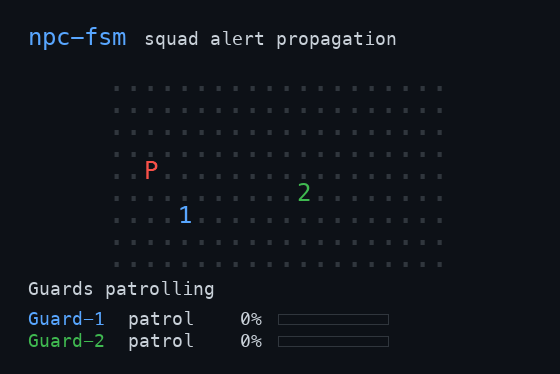

# npc-fsm

[](https://github.com/wuisabel-gif/npc-fsm/actions/workflows/ci.yml)
[](https://github.com/wuisabel-gif/npc-fsm/releases/latest)
[](LICENSE)

An engine-independent NPC behavior library written in **Squirrel**. It drives a guard with a finite-state machine you plug into your own game — no engine dependency.



*Guard-1 spots the target and radios it in; Guard-2 (nearby) is summoned and converges; Guard-3 (far away) never hears it. Same `guard.nut` as the single-guard demo — the squad behavior is all in the host.*

## Behavior states

```text
PATROL ──sees player──> CHASE ──close enough──> ATTACK
   ^                       │                       │
   │                       │ target escapes        │ player moves away
   │                       v                       v
RETURN <─────────────── SEARCH <─────────────── CHASE
   │
   └──reaches route──> PATROL
```

The guard can:

- Walk through four patrol waypoints
- Detect the player gradually via a suspicion meter that fills faster up close
- Remember the player's last known position
- Chase the player
- Attack with damage and a cooldown
- Search after losing the player
- Return to its patrol route
- React to damage and die
- Alert nearby guards on detection, so a squad converges (see `squad.nut`)

## Files

- `guard.nut` — the reusable, engine-independent guard behavior. Drop this into your game. No `print`, no loop, no hardcoded player.
- `player.nut` — the example target entity used by the demos.
- `demo.nut` — single-guard example host (`sq demo.nut`). Prints a live ASCII arena each tick: `G` guard, `P` player, `o` waypoints, `x` dead guard.
- `squad.nut` — multi-guard example host (`sq squad.nut`). One guard's alert summons nearby guards while a distant one stays on patrol; guards render as `1`/`2`/`3`.
- `host.cpp` — a ~200-line C++ program that embeds the Squirrel VM and drives `guard.nut`, implementing perception and events natively. Proof the library runs inside a real engine (see below).
- `test.nut` — self-check driving a guard through every state transition and the alert path (`sq test.nut`).

## Run the demos

Install or build the official Squirrel interpreter, then:

```bash
sq demo.nut     # one guard
sq squad.nut    # three guards + alert propagation
sq test.nut     # self-check (prints "all transitions OK")
```

Depending on your installation, the interpreter executable may have a different path or name.

## Plugging it into a game

The guard never touches the world directly — each frame your game hands it a `world` adapter and the guard talks back through it. Integration is one call per frame:

```squirrel
guard.update(deltaTime, world);                       // decide + act
guard.takeDamage(world, amount, attackerPosition);    // when the guard is hit
```

Your `world` object implements the engine boundary. Replace each stub with your real systems:

```text
world.target                     -> the entity the guard reacts to, or null
world.canSee(guard, target)      -> your field-of-view + raycast/occlusion test
world.emit(guard, event, data)   -> your animation / sound / UI / logging
world.moveToward(guard, dest, d) -> OPTIONAL: your navmesh/pathfinding/steering.
                                    Omit it to use the built-in straight-line move.
```

The target entity is duck-typed: it needs `.position {x,y}`, `.alive`, and `.takeDamage(amount)`. Events the guard emits: `state`, `waypoint`, `attack`, `damaged`, `death`, and `alert` (fired the moment suspicion tops out, carrying the target's last known position). See `demo.nut` for a complete working host you can copy — swapping distance-based sight for a real FOV cone and `print` for animation calls is the entire integration.

For a squad, forward the `alert` event to nearby guards via `guard.alertTo(world, position)` — `squad.nut` shows the whole pattern in its `emit` handler.

## Embedding in C++

`host.cpp` is a complete, self-contained example of running `guard.nut` from a native host. The C++ side implements the engine boundary — `canSee` (perception), `emit` (event reaction), the target entity, and the frame loop — as native functions; the behavior stays in the script. Build and run it against a Squirrel install:

```bash
brew install squirrel-lang     # or point -I/-L at your own Squirrel build
c++ -std=c++11 host.cpp -I/opt/homebrew/include -L/opt/homebrew/lib \
    -lsquirrel -lsqstdlib -o host && ./host
```

It drives the guard through the full state arc (`PATROL → CHASE → ATTACK → SEARCH → RETURN`), printing `[engine]` lines each time the script calls back into native code. Swap the bodies of `canSee`/`emit` for your raycasts and animation calls and the same script runs in your game.

## Suggested extensions

1. Add hearing: investigate the location of a loud sound.
2. Add cover: select a nearby cover point when health is low.
3. Add personality parameters: cautious, aggressive, or cowardly.
4. Add animation callbacks for walking, running, attacking, and death.

## Why Squirrel fits

Squirrel supports classes, tables, arrays, functions, and embedding in native applications, so gameplay behavior can stay editable outside the C++ engine. This project uses classes for the player and guard and an explicit state machine for predictable behavior.
