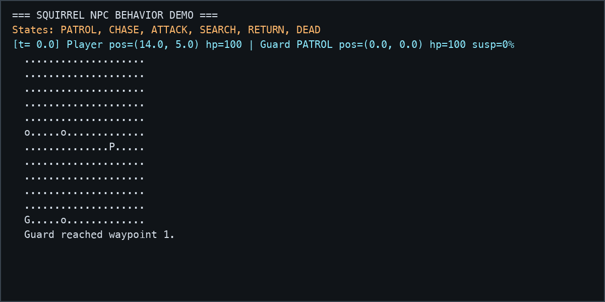
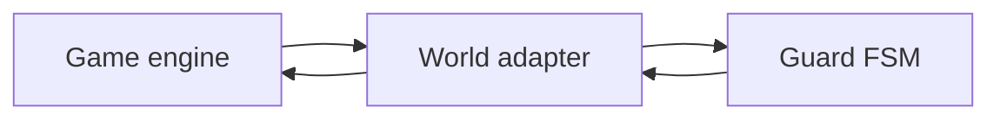
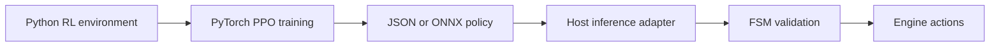

# NPC-FSM

[](https://squirrel-lang.org/)
[](host.cpp)
[](https://github.com/wuisabel-gif/npc-fsm/actions/workflows/ci.yml)
[](LICENSE)

An engine-independent NPC behavior library written in **Squirrel**. [Project website](https://wuisabel-gif.github.io/npc-fsm/)

`npc-fsm` provides a reusable finite-state machine for game characters. The
behavior logic is separated from the game engine through a small `world`
adapter, allowing the same NPC script to run in a custom C++ engine, a
prototype simulation, or another Squirrel-hosting environment.

The project is intentionally deterministic: the FSM is responsible for
high-level behavior and predictable transitions, while the host remains
responsible for perception, navigation, animation, sound, damage, and
rendering.


*Guard-1 spots the target and radios it in; Guard-2 (nearby) is summoned and converges; Guard-3 (far away) never hears it. Same `guard.nut` as the single-guard demo — the squad behavior is all in the host.*



*The terminal recording runs the real `demo.nut` host: the guard patrols, detects the player, chases, attacks, searches, and returns to its route.*

## Behavior states

```text
PATROL ──sees player──> CHASE ──close enough──> ATTACK
   ^                       │                       │
   │                       │ target escapes        │ player moves away
   │                       v                       v
RETURN <─────────────── SEARCH <─────────────── CHASE
   │
   └──reaches route──> PATROL
```

The guard can:

- Walk through four patrol waypoints
- Detect the player gradually via a suspicion meter that fills faster up close
- Remember the player's last known position
- Chase the player
- Attack with damage and a cooldown
- Search after losing the player
- Return to its patrol route
- React to damage and die
- Alert nearby guards on detection, so a squad converges (see `squad.nut`)

## Architecture

The guard never accesses the game world directly. Each frame, the host passes a
`world` adapter to the guard:

```text
world.target
world.canSee(guard, target)
world.emit(guard, event, data)
world.moveToward(guard, destination, distance)
```

`target` may be `null`, but the `target` property and the `canSee` and `emit`
callbacks are required. The optional `moveToward` property, when present, must
be callable and must return the guard's resulting `{x, y}` position. The
standalone `validateWorld(world)` helper checks this contract and `update()`
checks it at the start of every frame, producing an explicit error before a
malformed adapter reaches FSM logic.



This boundary makes the behavior portable. A host can use a real FOV cone,
raycast, navmesh, animation system, or network layer without changing
`guard.nut`. See `perception.nut` for a host-side FOV example and
`doc/ENGINE-INTEGRATION.md` for integration notes.

## Current state machine

```text
PATROL -> CHASE -> ATTACK
   ^        |          |
   |        |          |
RETURN <- SEARCH <------
```

The state machine is deterministic and intentionally acts as the authoritative
behavior and safety layer. This makes transitions easy to test and debug while
leaving engine-specific decisions at the adapter boundary.

## Machine-learning implementation and roadmap

The repository now includes a PyTorch reinforcement-learning training pipeline in
`training/`. It uses a synthetic Gymnasium environment modeled on the guard's
observable tactical state and trains a PPO policy with Stable-Baselines3. The
pipeline can run locally or in a Kaggle notebook and exports an evaluation
report plus a JSON policy artifact.

The training environment currently exposes:

- Guard position and target-relative position
- Target distance and visibility
- Suspicion, health, and attack cooldown
- Target life state
- Current FSM state

The policy chooses among patrol, chase, attack, search, and return actions. The
training environment is deliberately a surrogate: it does not replace
`guard.nut`, and a trained model is not committed to the repository. Run the
smoke test or follow [`training/README.md`](training/README.md) for local and
Kaggle training instructions.

The next runtime step is to connect the exported policy through a host-side
inference adapter. The FSM remains the authoritative safety layer: it validates
model recommendations and provides deterministic behavior when inference is
unavailable or a recommendation is invalid.



Future ML work includes:

- **Learned perception:** estimate visibility, detection confidence, target
  identity, occlusion, or threat level and use the result to influence the
  suspicion meter.
- **Learned navigation:** suggest search locations, cover positions,
  interception points, or pursuit strategies while the FSM validates the
  resulting behavior.
- **Engine deployment:** load a validated exported policy through a native
  C++/ONNX adapter or a Squirrel-compatible policy table.
- **Evaluation:** compare learned policies against the deterministic FSM using
  survival, detection, attack success, and squad-coordination metrics.

The recommended design is hybrid: the ML policy provides a recommendation, the
FSM remains the authoritative behavior controller, and the engine remains the
authoritative source of world state.

## Squad behavior

Squad communication is implemented by the host rather than hardcoded into the
guard library. When one guard detects the player, the host can forward its
`alert` event to nearby guards:

```squirrel
guard.alertTo(world, alertPosition);
```

This lets each game define its own radio range, team relationships, and network
behavior. The complete example is in `squad.nut`.
## Files

- `guard.nut` — the reusable, engine-independent guard behavior. Drop this into your game. No `print`, no loop, no hardcoded player.
- `player.nut` — the example target entity used by the demos.
- `demo.nut` — single-guard example host (`sq demo.nut`). Prints a live ASCII arena each tick: `G` guard, `P` player, `o` waypoints, `x` dead guard.
- `squad.nut` — multi-guard example host (`sq squad.nut`). One guard's alert summons nearby guards while a distant one stays on patrol; guards render as `1`/`2`/`3`.
- `perception.nut` — optional host-side distance + facing-cone perception helper with an occlusion hook; the demos show how to wire it into `world.canSee`.
- `grid_navigation.nut` — self-contained deterministic grid adapter implementing `world.moveToward` with obstacle-aware BFS.
- `navigation_example.nut` — focused runnable navigation check (`sq navigation_example.nut`).
- `doc/ENGINE-INTEGRATION.md` — concrete adapter notes for native C++ and Squirrel-hosting engines.
- `training/` — PyTorch PPO training environment, evaluation/export scripts, and Kaggle instructions for the tactical policy.
- `examples/godot/` — Godot 4 host-side GDScript adapter pattern with FOV/raycast, `NavigationAgent2D`, target mapping, and event handling. This is a conceptual port; Godot does not execute `guard.nut` without a native Squirrel bridge.
- `host.cpp` — a standalone C++11 embedding reference. `SquirrelVm` owns VM setup, while `SampleWorld` owns the demo target/world tables and native callbacks; production engines replace those sample callback bodies (see below).
- `test.nut` — self-check driving a guard through every state transition and the alert path (`sq test.nut`).

## Run the demos

Install or build the official Squirrel interpreter, then:

```bash
sq demo.nut                 # one guard
sq squad.nut               # three guards + alert propagation
sq test.nut                # self-check (prints "all transitions OK")
sq navigation_example.nut  # deterministic obstacle-aware movement check
```

Depending on your installation, the interpreter executable may have a different path or name.

## Plugging it into a game

The guard never touches the world directly — each frame your game hands it a `world` adapter and the guard talks back through it. Integration is one call per frame:

```squirrel
guard.update(deltaTime, world);                       // decide + act
guard.takeDamage(world, amount, attackerPosition);    // when the guard is hit
```

Your `world` object implements the engine boundary. Replace each stub with your real systems:

```text
world.target                     -> the entity the guard reacts to, or null
world.canSee(guard, target)      -> your field-of-view + raycast/occlusion test
world.emit(guard, event, data)   -> your animation / sound / UI / logging
world.moveToward(guard, dest, d) -> OPTIONAL: your navmesh/pathfinding/steering.
                                    It returns the authoritative new {x,y} position.
                                    Omit it to use the built-in straight-line move.
```

The target entity is duck-typed: it needs `.position {x,y}`, `.alive`, and `.takeDamage(amount)`. Events the guard emits: `state`, `waypoint`, `attack`, `damaged`, `death`, and `alert` (fired the moment suspicion tops out, carrying the target's last known position). See `demo.nut` for a complete working host you can copy — swapping distance-based sight for a real FOV cone and `print` for animation calls is the entire integration.

For a squad, forward the `alert` event to nearby guards via `guard.alertTo(world, position)` — `squad.nut` shows the whole pattern in its `emit` handler.

### Navigation adapter example

`navigation_example.nut` wires `world.moveToward` to `grid_navigation.nut`, a
small deterministic breadth-first grid navigator with blocked cells. The
callback returns the position after collision-free movement, and the guard
assigns that return value as its authoritative script position. This example is
intentionally a testable stand-in, not a production navigation system. Replace
`GridNavigator.path()`/`moveToward()` with your engine's navmesh or pathfinder
query, use the engine's collision-resolved transform, and return that transform
as `{x, y}` on every call (or the current authoritative position while an
asynchronous path request is pending).

## Embedding in C++

`host.cpp` is a complete, self-contained example of running `guard.nut` from a native host. The C++ side implements the engine boundary — `canSee` (perception), `emit` (event reaction), the target entity, and the frame loop — as native functions; the behavior stays in the script. Build and run it against a Squirrel install:

```bash
brew install squirrel-lang     # or point -I/-L at your own Squirrel build
c++ -std=c++11 host.cpp -I/opt/homebrew/include -L/opt/homebrew/lib \
    -lsquirrel -lsqstdlib -o host && ./host
```

The sample keeps the VM, world, target, and guard alive across the frame loop. `SquirrelVm` closes the VM last; `SampleWorld` releases its `HSQOBJECT` references before that close. In a game, retain the VM and guard for the actor lifetime, update the world target each frame, and call `guard.update(deltaTime, world)`. Replace `sampleCanSee`, `sampleEmit`, and `sampleTakeDamage` with raycasts, presentation/event dispatch, and authoritative damage handling; keep callback-time handle resolution and do not retain pointers to destroyed engine objects. The sample’s straight-line target movement and frame loop are also intended replacement points.

## Suggested extensions

1. Add hearing: investigate the location of a loud sound.
2. Add cover: select a nearby cover point when health is low.
3. Add personality parameters: cautious, aggressive, or cowardly.
4. Add animation callbacks for walking, running, attacking, and death.

## Why Squirrel fits

This is a practice project — a small, focused way to learn how game AI is structured and how a scripting language embeds in a native engine. Squirrel is a good fit for both goals.

Squirrel is a lightweight scripting language built to be embedded in C/C++ applications, with classes, tables, arrays, and first-class functions. That embeddability is the whole point: gameplay behavior lives in a script the engine loads at runtime, so you can tweak how a guard thinks without recompiling the engine — and `host.cpp` shows exactly that. The library leans on the parts that make behavior code readable: a `GuardNPC` class holds the guard's state, and an explicit finite-state machine keeps its decisions predictable and easy to reason about — which is what makes it a clear example to learn from.
