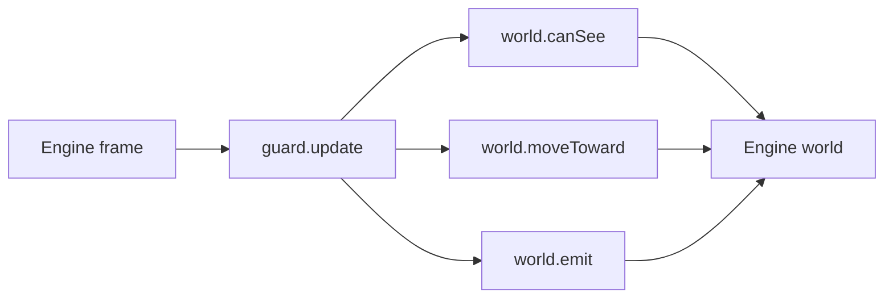

# Engine integration notes

`guard.nut` owns only decisions and state. The game owns entities, perception,
movement, and presentation through the small `world` adapter:



`grid_navigation.nut` and `navigation_example.nut` provide a runnable Squirrel
stand-in: a deterministic BFS over a small blocked-cell grid. It demonstrates
the important contract without requiring an engine or navmesh. Replace the
`GridNavigator` implementation with a real navmesh/pathfinder query in a game;
the adapter should return the engine's collision-resolved, authoritative
`{x, y}` transform after each step. If pathfinding is asynchronous, return the
current authoritative position until the request completes rather than
predicting movement in Squirrel.

## A native C++ engine

`host.cpp` is a standalone C++11 reference adapter. Build it from the repository root against Squirrel 3.x (adjust paths as needed):

```bash
c++ -std=c++11 host.cpp -I/opt/homebrew/include -L/opt/homebrew/lib \
    -lsquirrel -lsqstdlib -o host && ./host
```

`SquirrelVm` owns VM creation/closure, `SampleWorld` owns the referenced target
and world tables, and `main` owns the guard reference and frame loop. Release
`HSQOBJECT`s before closing their VM. Keep those objects alive across frames;
recreating a guard resets its timers, suspicion, and last-known position.

Replace `sampleCanSee`, `sampleEmit`, and `sampleTakeDamage` with the engine's
raycast/perception, event/presentation, and authoritative damage systems. The
sample target movement in `SampleWorld::moveTarget` and the loop in `main` are
similarly replaceable. Native callbacks should resolve engine handles at call
time and must not retain pointers to actors that may be destroyed.


- `world.target` is a handle or wrapper for the current target (the property is required, and may be null).
- `canSee` and `emit` are required callable callbacks; `validateWorld(world)` can be used for an explicit boundary check.
- `moveToward` is optional. If supplied, it must return the resulting `{x, y}` position; otherwise the guard uses its straight-line fallback.
- `canSee` first checks the guard's view cone and then performs the engine's
  collision/raycast query. `perception.nut` contains a Squirrel-only cone
  example with an optional occlusion callback.
- `moveToward` submits a destination to the navigation system and returns the
  resulting `{x, y}` position. It can return the current position while a
  path request is pending.
- `emit` translates `state`, `attack`, `death`, and `alert` into animation,
  audio, damage, or gameplay events.

The C++ host should retain the VM and the guard object between frames. Load the
script once, push the adapter object as the `world` argument on each update,
and call `takeDamage` from the engine's damage callback. Do not recreate the
guard every frame, or its suspicion, timers, and last-known position disappear.

## OpenTTD-style Squirrel host

For an engine that already embeds Squirrel, the integration is the same without
the C++ VM setup. Store one `GuardNPC` per town/vehicle/agent in the AI's
persistent table. On each game tick, construct (or reuse) a world adapter:

```squirrel
world.target <- target;
world.canSee <- function(guard, target) {
    return target.alive && in_view_cone(guard, target)
        && !line_is_blocked(guard.position, target.position);
};
world.moveToward <- function(guard, destination, distance) {
    return pathfinder_step(guard, destination, distance);
};
world.emit <- function(guard, event, data) {
    if (event == "attack") apply_damage(target, data.damage);
    else if (event == "alert") radio_nearby_guards(data.position);
};
validateWorld(world); // optional early check; update() also checks per frame
guard.update(ticks_to_seconds(ticks), world);
```

Use the host's own coordinate and tick units; `deltaTime` is seconds in the
examples. If the host cannot return a moved position immediately, return the
agent's current position and update `guard.position` from the authoritative
engine transform before the next tick.

## Unreal/Godot-style native wrapper

When the engine does not expose Squirrel directly, put the VM behind a small
C++/GDExtension (or module) wrapper. Convert the engine actor/node to a table
with `position`, `alive`, and `takeDamage`, bind the four world callbacks, and
keep the Squirrel instance as a component attached to the actor. The guard
library does not need to know which engine supplied those callbacks.

The important ownership rule is that callbacks must not retain stale target or
actor pointers. Resolve handles at callback time, and stop calling `update`
when the actor is destroyed or the guard reaches `DEAD`.
