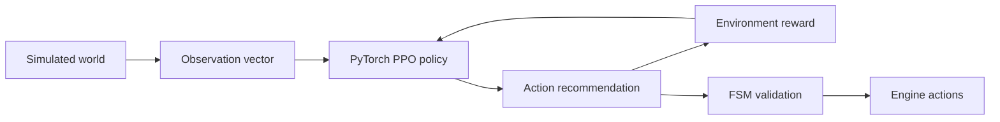

# Machine-learning training logic

This document explains how the current PyTorch reinforcement-learning pipeline
works and how its output is intended to connect to the deterministic Squirrel
FSM.

## Design goal

The goal is not to replace `guard.nut` with an opaque model. The goal is to
train a tactical policy that recommends an action from the current world state.
The FSM remains responsible for validating transitions and executing safe,
engine-independent behavior.



## Repository components

```text
training/env.py          Synthetic Gymnasium environment
training/train.py        PPO training and deterministic smoke test
training/evaluate.py     Evaluation and policy export
training/requirements.txt Python dependencies
training/README.md        Local and Kaggle commands
```

The environment is a training surrogate. It mirrors important guard concepts,
but it is not the game engine and does not execute Squirrel.

## 1. Environment reset

At the start of every episode:

1. The guard starts near the center of a bounded 2-D world.
2. The target is placed at a random position.
3. The target receives a random velocity.
4. Health is reset to `100`.
5. Suspicion is reset to `0`.
6. The attack cooldown is reset.
7. The target is marked alive.
8. The guard starts in `PATROL`.

A seed can be provided to `reset()` so that evaluation and debugging are
repeatable.

## 2. Observation vector

The policy receives a normalized vector with 16 values. The ordering is part of
the exported policy contract and must not change without changing the model.

```text
[0..1]    guard position (x, y)
[2..3]    target-relative position (x, y)
[4]       target distance
[5]       target visibility (0 or 1)
[6]       suspicion level
[7]       guard health
[8]       attack cooldown
[9]       target alive state (0 or 1)
[10..15]  current state one-hot encoding
```

The current state encoding is:

```text
0 PATROL
1 CHASE
2 ATTACK
3 SEARCH
4 RETURN
5 DEAD
```

Values are normalized to approximately `0..1` so that the neural network can
train more consistently. The target-relative coordinates are clipped to the
training world's bounds.

## 3. Action space

The policy selects one discrete action:

```text
0 PATROL
1 CHASE
2 ATTACK
3 SEARCH
4 RETURN
```

These are recommendations, not unrestricted state mutations. The environment
and, eventually, the real FSM validate whether an action is legal.

For example, an `ATTACK` recommendation is not successful when the target is
outside attack range. In the real game, the FSM should reject that
recommendation and continue pursuing the target instead.

## 4. Environment transition

Each action advances the simulation by one time step. The current default time
step is `0.25` seconds.

### Perception and suspicion

If the target is alive and inside sight range:

```text
closeness = max(0.2, 1 - distance / sight_range)
suspicion += 1.6 × closeness × delta_time
```

If the target is not visible:

```text
suspicion -= 0.5 × delta_time
```

Suspicion is clamped between `0` and `1`.

When suspicion reaches `1`, the simulated guard commits to `CHASE`, matching
the important detection behavior of `guard.nut`.

### Movement

`CHASE` moves toward the target at chase speed. `SEARCH`, `RETURN`, and the
basic patrol behavior use the slower movement speed. The target continues to
move during the episode, which prevents the policy from learning only a fixed
position lookup.

### Attack

An attack succeeds only when:

```text
target is alive
and distance <= attack range
and attack cooldown == 0
```

A successful attack defeats the target in the current toy environment. The
full Squirrel FSM supports health and repeated damage, so the training
surrogate can be expanded later if repeated combat is needed.

### Episode termination

An episode ends when:

- The target is defeated; or
- The maximum episode duration is reached.

The target defeat condition is reported as a successful episode during
 evaluation.

## 5. Reward design

The reward intentionally makes defeating the target clearly optimal. Every step costs `-0.01`; CHASE/SEARCH receive only positive distance-progress shaping, capped at `+0.75` over an episode. Detection gives a one-time `+0.10` event reward. A successful in-range attack defeats the target and gives `+10.0`. Out-of-range attacks cost `-0.25`, malformed/out-of-space actions cost `-0.5`, and timeout costs `-2.0`. There is no recurring reward for repeatedly chasing, searching, or remaining visible, so farming cannot replace terminal success. Reward components are included in the step `info` mapping for smoke/debug analysis.
Future reward terms could include:

- Damage taken by the guard
- Successful squad alerts
- Reaching useful search locations
- Avoiding repeated or unnecessary transitions
- Protecting an objective
- Surviving for a target time

## 6. PPO training

`training/train.py` creates a Stable-Baselines3 PPO agent with an MLP policy:

```text
16-value observation
        ↓
    MLP policy
        ↓
5 action logits
```

PPO repeatedly collects trajectories from the environment and updates the policy while limiting how far each update can move the policy. This is useful for a small discrete tactical problem because it is more stable than directly changing the policy after every individual action.

PPO training defaults to `device="cpu"`: this environment has a 16-value observation and a small MLP, where GPU transfer overhead is usually counterproductive. Override it when appropriate:

```bash
python -m training.train --timesteps 100000 --device auto
```

A training command is:

```bash
python -m training.train \
    --timesteps 100000 \
    --output training/artifacts/ppo_guard
```

The output is an SB3 model file:

```text
training/artifacts/ppo_guard.zip
```

The deterministic smoke mode does not train a neural model. It verifies that
the environment can reset, step, produce rewards, and terminate:

```bash
python -m training.train --smoke
```

## 7. Evaluation

Evaluation runs the trained model with deterministic action selection instead
of exploration. It reports:

```text
mean_return
    Average total reward per episode.

win_rate
    Fraction of episodes in which the target was defeated.
```

Run evaluation with:

```bash
python -m training.evaluate \
    --model training/artifacts/ppo_guard \
    --episodes 100 \
    --export training/artifacts/policy.json
```

A single metric is not enough to establish good NPC behavior. A useful
experiment should compare the learned policy with the hand-coded baseline and
inspect behavior across multiple random seeds.

## 8. Kaggle workflow

Kaggle is used as a compute environment, not as part of the game runtime.

```text
Kaggle notebook
    ↓
Install training/requirements.txt
    ↓
Run PPO training
    ↓
Evaluate policy
    ↓
Download ppo_guard.zip and policy.json
```

A minimal Kaggle sequence is:

```python
!git clone https://github.com/wuisabel-gif/npc-fsm.git /kaggle/working/npc-fsm
%cd /kaggle/working/npc-fsm
!pip install -q -r training/requirements.txt
!python -m training.train --smoke
!python -m training.train --timesteps 100000 --output /kaggle/working/ppo_guard
!python -m training.evaluate --model /kaggle/working/ppo_guard --episodes 100 --export /kaggle/working/policy.json
```

No Kaggle credential is required by the repository. The notebook owner runs
the training and downloads the resulting artifacts.

## 9. Export format

`policy.json` contains:

- A format identifier
- Observation size and ordering
- Action names
- The PyTorch/SB3 policy state dictionary
- Compatibility notes

The JSON is an interchange and debugging artifact. The Squirrel runtime does
not currently execute PyTorch tensors or SB3 state dictionaries.

## 10. Runtime integration plan

The next integration layer must convert a real guard observation into the same
16-value order, run inference, and pass the recommendation to the FSM.

```text
Engine world state
        ↓
Observation encoder
        ↓
Policy inference adapter
        ↓
Recommended action
        ↓
FSM transition validation
        ↓
world.moveToward / world.emit / target actions
```

Possible deployment implementations are:

1. A Squirrel-readable tabular policy export for a lightweight runtime.
2. A native C++ adapter using ONNX Runtime for a neural policy.
3. A host-side Python service for prototyping only.

The production game should not trust a model to mutate state directly. The
adapter should validate model output, provide a deterministic fallback when
inference fails, and keep the engine authoritative for positions, health,
damage, and collisions.

## Limitations

- The synthetic environment is not a complete copy of `guard.nut`.
- The current policy does not use images, audio, raycasts, or real navmeshes.
- The exported neural policy is not yet consumed by Squirrel.
- A short training run is not evidence of general game intelligence.
- Reward and observation design need evaluation before use in a real game.
- No trained model artifact is committed to the repository.
